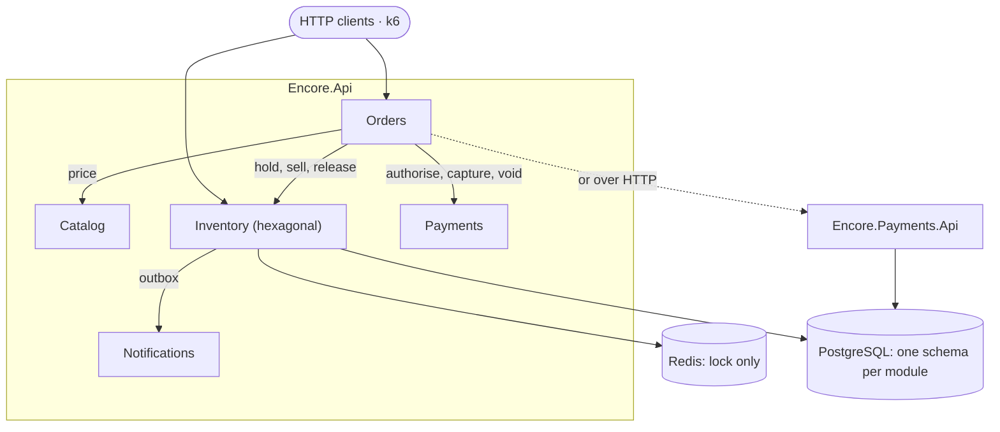
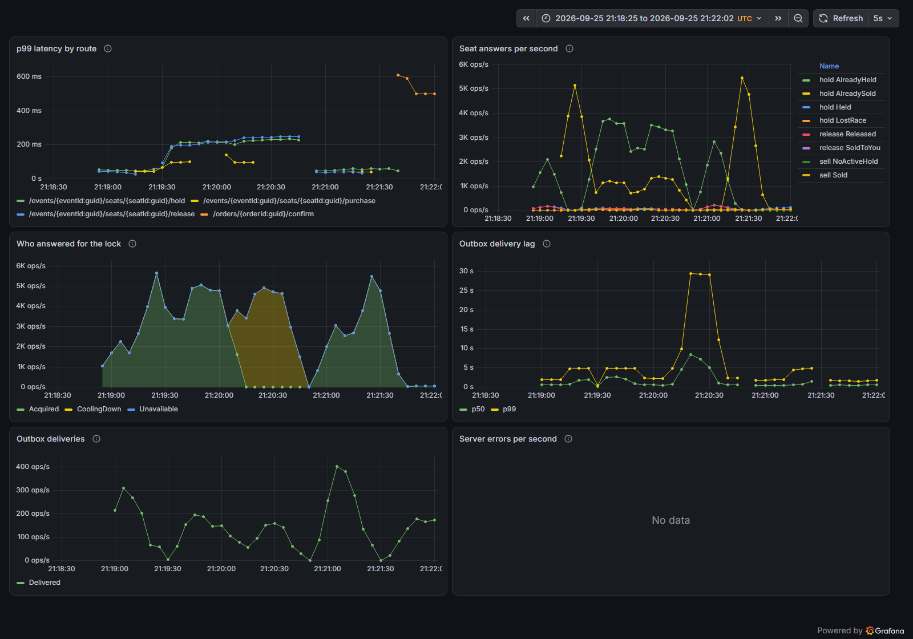
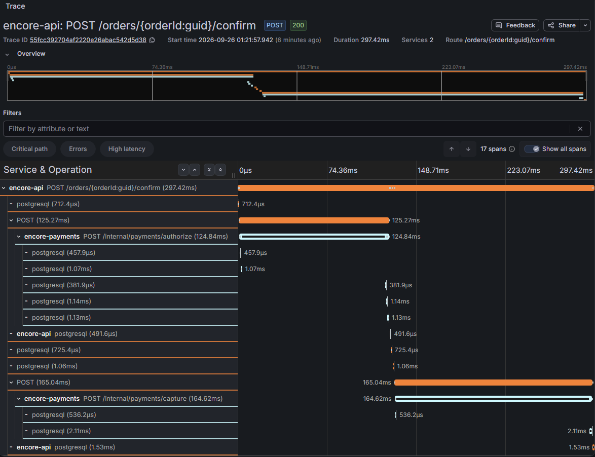

# Encore

[](https://github.com/bekammo/Encore/actions/workflows/tests.yml)
[](LICENSE)

**A flash-sale ticketing backend that sells every seat exactly once, even with Redis killed
mid-sale.**

When a big show goes on sale, thousands of people click at once, and plenty of them click the
same seat. Encore is built around that moment. It's a .NET 10 modular monolith with five
modules: four are plain CRUD, and one, Inventory, gets the full hexagonal treatment. That
imbalance is the point. The project asks where architecture is actually worth paying for, and
tries to answer with measurements.

- **Result:** 500 of 500 seats sold and none oversold, across 690,000–740,000 hold attempts a
  run. Stop Redis mid-sale and nothing oversells. Stop the payment service and no order is
  confirmed without payment.
- **Stack:** C# · ASP.NET Core minimal APIs · EF Core 10 on PostgreSQL 16 · Redis 7 · xUnit
  with Testcontainers · k6 · OpenTelemetry and Grafana · Docker Compose · GitHub Actions.
- **Try it:** `docker compose up -d && dotnet run --project src/Encore.Api`, then open
  http://localhost:5107/docs/.

**Where to go from here**
- [WRITEUP.md](WRITEUP.md) is the story in one sitting: what I built, what broke under load,
  and what that changed.
- [DECISIONS.md](DECISIONS.md) holds 35 decisions, each with the alternative it beat and what
  it costs. If you only read five: [001][d001] (the thesis), [005][d005] (a rule allowed to
  fail open), [010][d010] (why the sale sits between authorise and capture), [018][d018] (an
  extraction that did nothing for four days) and [032][d032] (a regression found by
  measuring again).
- [docs/CONFIGURATION.md](docs/CONFIGURATION.md) lists every setting, its default and where
  it's set.

## Results

Measured on 2026-09-25 with k6 against the containerised system. Faults were injected by
[`load/chaos.sh`](load/chaos.sh) and the aftermath read back out of Postgres. The full report
and the baseline digests are committed in [`load/evidence/`](load/evidence/2026-09-25/).

| Scenario | Outcome |
|---|---|
| Flash sale: 100 clients, 500 seats | 500 of 500 sold, **none oversold**, 690,000–740,000 hold attempts a run across two one-minute scenarios. Contended hold p99 31–36 ms. |
| Redis stopped mid-sale | **No oversell.** Seats kept selling on Postgres alone. A hold cost no more at the median; a purchase cost about 2×. |
| Payments service stopped | **No order confirmed without payment**, and every seat still held maps to an open order. |
| Event dispatcher stalled for 20 s | Request path unaffected (hold p99 6.2 ms). Events arrived late, and none were lost. |
| Two payment reconcilers on one table | **No payment settled twice.** |
| 965 orders, confirm racing cancel, one capture in twenty refused | **No order partly sold, none paid for without its seats, and no seat sold unpaid unless its order says `payment_due`.** 33 captures were refused; the customers who confirmed again paid. |

These are one laptop's numbers. They're good for comparing one run with the next, not as a
capacity claim: the same code has drifted by about a sixth between sessions on this machine
alone ([032][d032]). The order invariants don't depend on the laptop, though.
`CheckoutCompositionTests` asserts them on every CI run, and the chaos script exits non-zero
if any of them breaks.

## Architecture



| Module | Shape | Why |
|---|---|---|
| **Inventory** | Hexagonal: `Domain` / `Ports` / `Adapters` / `Application` | Seat contention under load, the one hard problem here. |
| **Orders** | Flat: `Endpoints` / `Data` / `Models` | Orchestrates checkout across the other modules through their contracts. |
| **Payments** | Flat, with a guarded `Payment` state machine | A simulated gateway that declines, hangs and loses requests on demand. |
| **Catalog** | Flat | Read-mostly CRUD: venues, events, prices. |
| **Notifications** | Flat, no HTTP surface | Consumes `SeatSold` from Inventory's outbox. |

Why does only one module get ports and adapters? Because they're a cost you pay for the
option to swap what sits behind them, and that's only worth paying where you'll use the
option. In Inventory, storage, locking and messaging each had a real alternative, and each
alternative was measured. The other four modules have no contention and no rules that span
rows, so layering them would buy nothing.

**The boundaries are enforced by the build and by tests, not by convention.**
- Inventory's domain is its own assembly with **zero package references**. Three MSBuild rules
  (`ENCORE001`–`003`) fail the build if a package, a framework reference or a transitive
  dependency reaches it. The shared kernel and the three `.Contracts` assemblies are held to
  the same rules.
- Modules reach each other only through `.Contracts` assemblies.
- A host composes each module through exactly one seam: `Add{Module}Module` /
  `Map{Module}Module`.
- `Encore.ArchitectureTests` checks all of it again, over project files, source and compiled
  metadata.

**Payments runs in process or as its own service.** `Encore.Payments.Api` hosts the same
module behind three internal routes. One configuration key switches Orders between the
in-process adapter and the HTTP one, and a composition test runs Orders' HTTP client against
the real routes. It's a Strangler Fig extraction, and for four days it quietly did nothing
until a chaos run caught it ([018][d018]).

<details>
<summary>Solution layout</summary>

```
src/
  Encore.Api                          monolith host
  Encore.Payments.Api                 Payments as its own service
  Encore.Shared                       two BCL-only interfaces every module may see
  Encore.Telemetry                    the hosts' OpenTelemetry and health-check wiring
  Encore.Modules.Shared.Persistence   migrator and schema wiring; may not name a module
  Encore.Modules.Shared.Http          endpoint filters and per-IP rate limiting; may not name a module
  Encore.Modules.Inventory.Domain     Seat aggregate, events, exceptions; no packages
  Encore.Modules.Inventory            ports, adapters, use cases, outbox
  Encore.Modules.{Catalog,Orders,Payments,Notifications}
  Encore.Modules.{Inventory,Catalog,Payments}.Contracts   public faces; no packages
tests/
  Encore.ArchitectureTests            boundaries over csprojs, source and metadata
  *.UnitTests                         domain, handlers, HTTP mapping, state machines
  *.IntegrationTests                  real Postgres and Redis via Testcontainers
load/
  flash-sale.js, chaos.sh             the k6 harness and the fault injector
```

</details>

## How a seat is sold

**`Seat` is the aggregate, and the only consistency boundary.** A hold isn't a separate
entity, just two columns on the seat row (`HeldByClientId` and `HoldExpiresAt`). Taking,
losing or converting a hold always changes exactly one row.

- **Postgres settles every race.** `RowVersion` maps to Postgres's `xmin` system column, so
  optimistic concurrency needs no code to maintain the token. One test sends fifty clients at
  one seat with no lock anywhere, and exactly one wins.
- **Redis holds a lock, never data.** Its only job is to serialise one client's requests
  against the four-seat hold cap. If Redis dies the system stays correct and the cap becomes
  best-effort. A breached cap means a refund; an oversell means a customer standing outside a
  sold-out venue.
- **Expiry is lazy.** Once a hold's five minutes are up, every read and write path treats the
  seat as available, whatever the row still says. A background sweep tidies rows, but switch
  it off and every test still passes. `ExpiryWithoutTheSweepTests` exists to prove it.
- **The aggregate owns the rules.** Callers pass in the current time, never an expiry, so no
  caller can reach a state the rules didn't approve.
- **Events leave through a transactional outbox.** Each transition is written to
  `inventory.outbox_messages` in the seat's own transaction, so a sale and its announcement
  commit together or not at all. A dispatcher claims rows with `FOR UPDATE SKIP LOCKED`,
  delivers at least once, backs off, and dead-letters after five attempts. No seat rule
  depends on it running.

**Checkout** in Orders authorises the payment, sells every seat in one transaction, and only
then captures. The one step that can't be undone, the sale, sits between two that can
([010][d010]).
- Any path that doesn't end with every seat sold voids the authorisation.
- A capture the gateway refuses leaves the order `payment_due`, not `failed`. The seats stay
  sold, and the customer's next confirm authorises again and pays ([034][d034]).
- A cancel releases the seats before it touches the money, so it can never refund a seat it
  couldn't release.
- Once money has moved, no step is abandoned halfway, even if the client disconnects.
- Two background jobs clean up after a crash: a reconciler settles payments the gateway never
  answered, and a capture sweep finishes orders that sold but were never captured. No
  invariant depends on either. Switch one off and nothing is oversold or charged twice; the
  loose end just waits for the customer's next confirm.
- A third job ends what a customer abandons. An expiry sweep finds `Pending` orders whose
  holds lapsed, gives their seats back, then voids their money, asking Inventory about each
  seat first ([031][d031]).

## Running it

You'll need Docker and the .NET 10 SDK.

```bash
docker compose up -d                          # Postgres 16 and Redis 7
dotnet run --project src/Encore.Api           # API at http://localhost:5107, docs at /docs/
```

Or run the whole stack in containers:

```bash
docker compose --profile load up -d --build api --wait    # http://localhost:8080/docs/
```

To walk through a checkout from `/docs/`, set two headers under **Authorize**:
- `X-Operator-Key: local-operator-key` lets you create a venue, an event and its seats. The
  development launch profile sets this key, and the containers default to it
  (`OPERATOR_API_KEY` overrides it).
- `X-Client-Id` can be any non-empty GUID. Use it to open an order, then confirm it.

Postgres is published on host port **55432**, not 5432, because a local install often owns
5432 already.

| Task | Command |
|---|---|
| All tests | `docker compose run --rm --build tests` |
| Filtered tests | `docker compose run --rm --build tests --filter "FullyQualifiedName~SeatTests"` |
| Load test | `docker compose run --rm --build load` |
| Chaos runs | `bash load/chaos.sh` (or `bash load/chaos.sh orders`) |
| Telemetry | `docker compose --profile telemetry up -d lgtm`, then Grafana on `:3000` |

## API

Interactive docs are served at `/docs/` from a hand-written OpenAPI document. A test fails if
the document and the mapped routes disagree in either direction, and it pins every documented
status enum to the C# enum behind it.

| Route | Purpose |
|---|---|
| `GET /health` · `GET /health/ready` | Liveness; readiness, voted on by the modules that register a check (Inventory and Payments). |
| `POST /catalog/venues` · `POST /catalog/events` | Create a venue, or a priced event at one. Needs `X-Operator-Key`. |
| `GET /catalog/venues[/{id}]` · `GET /catalog/events[/{id}]` | Browse the catalogue. |
| `POST /events/{eventId}/seats` | Create an event's seats. Needs `X-Operator-Key`. |
| `POST /events/{eventId}/seats/{seatId}/hold` · `release` · `purchase` | Seat actions, each idempotent. Off unless `Inventory:ExposeSeatRoutes` is set, since they sell without an order. |
| `POST /orders` | Open a checkout: price the event and hold every seat. Rate-limited per IP. |
| `GET /orders/{orderId}` | Read one of the caller's orders. |
| `POST /orders/{orderId}/confirm` · `cancel` | Pay for the order, or end it. |
| `GET /payments/{paymentId}` · `GET /payments?orderId=` | See what happened to a payment. |
| `POST /internal/payments/authorize` · `capture` · `void` | `Encore.Payments.Api` only, for Orders. Needs `X-Service-Token`. |

Refusals come back as `409` with a machine-readable `reason` and a `retriable` flag, so a
client branches on `reason`, not on the status code:

```json
{ "title": "Seat unavailable", "status": 409, "reason": "already_held", "retriable": true }
```

## Testing

Over 700 tests: unit tests for the domain and handlers, integration tests against real
Postgres and Redis through Testcontainers, and architecture tests. The suite runs in a
container, identically on a laptop and in CI.

CI doesn't trust the exit code of `docker compose run`, which is 0 even when nothing ran. It
counts one summary line per test project instead, so a project that never executed fails the
build.

On top of the usual layers:
- **Concurrency tests** race real clients against one seat, and against one order's confirm
  and cancel.
- **Falsification tests** switch the background jobs off and check that nothing correct
  depended on them.
- **Composition tests** run the real modules together across each seam, because testing each
  side of a seam separately turned out not to prove the seam ([018][d018]).

## Observability

OpenTelemetry traces, metrics and logs feed a provisioned Grafana dashboard. Telemetry is off
unless `OTEL_EXPORTER_OTLP_ENDPOINT` is set, which keeps load runs comparable. A confirm shows
up as one trace across both processes. Only Inventory defines instruments of its own, at its
adapter edges:

| Metric | What it answers |
|---|---|
| `encore.inventory.seat.outcomes` | What each seat answered: held, lost the race, already sold… |
| `encore.inventory.lock.attempts` | What Redis answered, and when the client stopped asking it |
| `encore.inventory.outbox.deliveries` | Delivered, failed, dead-lettered, by event type |
| `encore.inventory.outbox.delivery.lag` | How late delivery runs, from seat change to handler |



*A Redis fault run followed by an orders run, with telemetry on (so slower than the results
above). While Redis is down, the lock's answers switch from `Acquired` to `CoolingDown`, and
the seats keep selling.*



*One confirm: the authorisation in `encore-payments`, the sale of the seats in `encore-api`,
then the capture. It's the ordering [010][d010] argues for, visible in a single trace.*

## Trade-offs and limitations

I scoped the project to keep the depth in one place. Each of these is a choice, and each is
argued in `DECISIONS.md`:

- **No customer authentication.** `X-Client-Id` is a claimed identity: enough to exercise
  contention and per-client rules, not enough to stop abuse. The gap is narrowed in other
  ways ([030][d030]):
  - The direct seat routes the load harness drives are off by default.
  - Operator writes need a shared key.
  - Checkout and holds are rate-limited per IP address. That's a floor against one machine,
    not a defence against a botnet. Real identity and a waiting room would be.
- **Losing Redis still costs something.** While Redis is down, a purchase costs about 2× at
  the median. A Postgres advisory lock removes that cost and keeps the cap enforced without
  Redis, but it costs about 16% of throughput while Redis is healthy. It's one configuration
  key away, and Redis stays the default ([005][d005]).
- **Payments' data didn't move.** Payments runs as its own process, but its schema still
  lives in the shared database ([018][d018]).
- **No message bus.** Events are delivered in process from the outbox. Cross-process
  delivery, and with it `Payment` domain events, waits for a consumer that needs it
  ([013][d013]).
- **The payment gateway is simulated.** It can decline, time out, lose requests and refuse a
  capture, but it never refuses a void ([014][d014]).
- **A refused capture can leave seats sold and unpaid.** The order says so (`payment_due`),
  and nothing re-charges the customer unasked. Collecting from someone who never confirms
  again is an operator's job ([034][d034]).
- **No deployment.** It runs under Docker Compose on one machine. A cloud deployment would
  add cost without adding evidence: the chaos rig works by stopping containers, which it
  can't do to managed services, and the invariants hold wherever k6 runs ([026][d026],
  [035][d035]).

## How this was built

I built Encore between 18 and 26 September 2026 with Claude Code, an AI coding assistant.
The problem and the architecture were mine:
- the flash sale as the one hard problem;
- the invariants the system must never break;
- the thesis that only Inventory earns ports and adapters.

I reviewed the assistant's changes as they came, accepting, rejecting and redirecting them.
Each change landed as a pull request that ran the full suite in CI before it merged.
[DECISIONS.md](DECISIONS.md) records the reasoning behind those calls, wrong turns included.

[d001]: DECISIONS.md#001--inventory-is-hexagonal-and-everything-else-is-flat
[d005]: DECISIONS.md#005--the-hold-cap-is-a-policy-not-an-invariant
[d010]: DECISIONS.md#010--authorise-sell-capture
[d013]: DECISIONS.md#013--payment-has-a-state-machine-and-one-live-attempt-per-order
[d014]: DECISIONS.md#014--a-timed-out-authorisation-is-reconciled-by-asking-the-gateway
[d018]: DECISIONS.md#018--payments-becomes-a-service-and-a-seam-is-not-proven-by-testing-each-side-of-it
[d026]: DECISIONS.md#026--why-there-is-no-deployment
[d030]: DECISIONS.md#030--what-checkout-does-not-guard-is-closed-keyed-or-rate-limited
[d031]: DECISIONS.md#031--an-abandoned-order-is-expired-by-a-sweep-that-asks-inventory-first
[d032]: DECISIONS.md#032--a-holds-one-read-counts-its-rows-instead-of-compiling-a-predicate
[d034]: DECISIONS.md#034--a-refused-capture-leaves-the-order-payment_due-never-failed
[d035]: DECISIONS.md#035--the-multi-host-run-is-dropped
